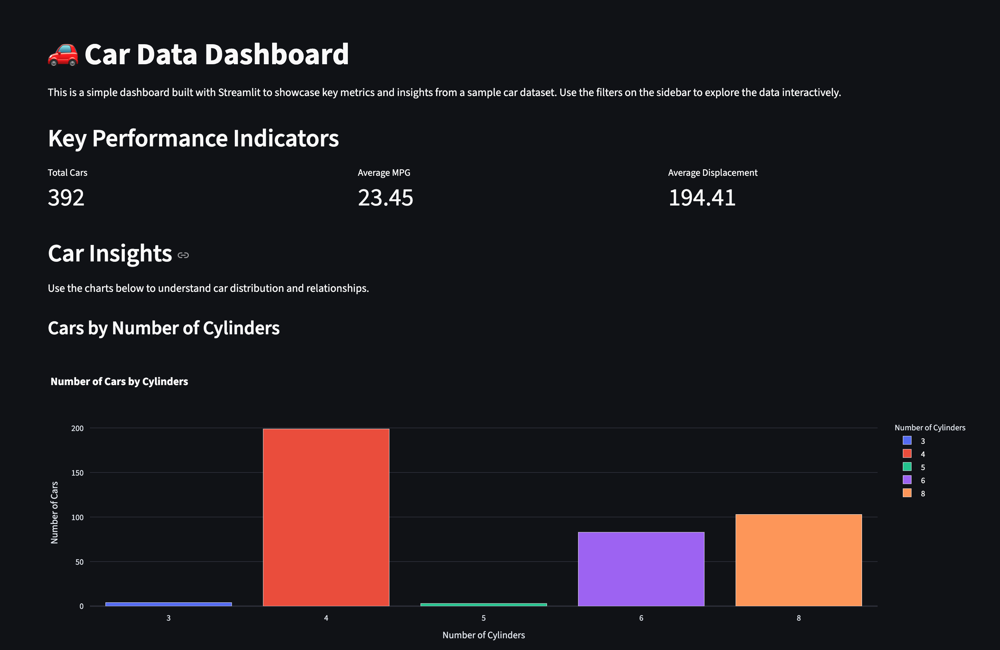

# Streamlit Demo App

## Dashboard Preview


This is a simple demo application built with [Streamlit](https://streamlit.io/).

## Features
- Loads and displays data from `cars.json`
- Interactive UI powered by Streamlit

## Getting Started

### Prerequisites
- Python 3.13+
- [Streamlit](https://streamlit.io/)
- [uv package manager](https://github.com/astral-sh/uv)

### Installation
1. Clone the repository:
   ```bash
   git clone <repo-url>
   cd streamlit-demo-app
   ```
2. Install dependencies using uv:
   ```bash
   uv sync
   ```
3. Activate the env in your local shell.
    ```bash
    source .venv/bin/activate
    ```

### Running the App
```bash
streamlit run main.py
```

## Project Structure
- `main.py` — Main Streamlit app
- `cars.json` — Sample data file
- `pyproject.toml` — Project dependencies/config
- `uv.lock` — Lock file for uv/poetry
